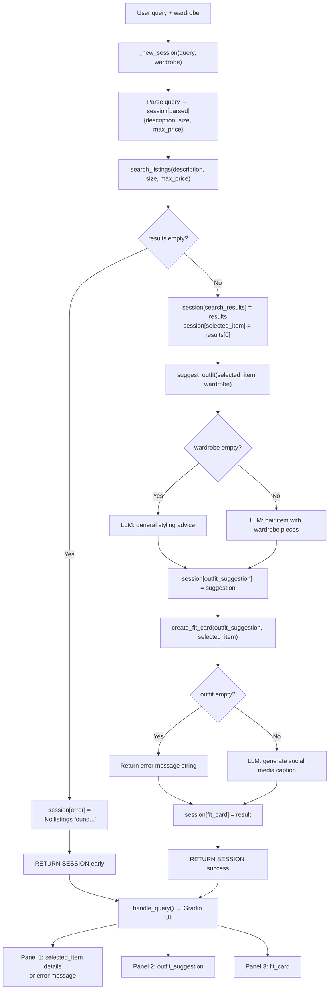

# FitFindr — planning.md

> Complete this document before writing any implementation code.
> Your spec and agent diagram are what you'll use to direct AI tools (Claude, Copilot, etc.) to generate your implementation — the more specific they are, the more useful the generated code will be.
> Your planning.md will be reviewed as part of your submission.
> Update it before starting any stretch features.

---

## Tools

List every tool your agent will use. For each tool, fill in all four fields.
You must have at least 3 tools. The three required tools are listed — add any additional tools below them.

### Tool 1: search_listings

**What it does:**
Searches the 40-item mock listings dataset for items matching a text description, optional size filter, and optional max price. Returns results ranked by keyword relevance (highest keyword overlap first).

**Input parameters:**
- `description` (str): Keywords describing what the user is looking for (e.g., "vintage graphic tee").
- `size` (str | None): Size string to filter by, case-insensitive (e.g., "M" matches "S/M"). None to skip size filtering.
- `max_price` (float | None): Maximum price inclusive (e.g., 30.0 filters out anything above $30). None to skip price filtering.

**What it returns:**
A list of listing dicts sorted by relevance score (best match first). Each dict contains: `id` (str), `title` (str), `description` (str), `category` (str), `style_tags` (list[str]), `size` (str), `condition` (str), `price` (float), `colors` (list[str]), `brand` (str or None), `platform` (str). Returns an empty list `[]` if nothing matches; never raises an exception.

**What happens if it fails or returns nothing:**
The agent sets `session["error"]` to a helpful message like "No listings found matching your search. Try broadening your description, removing the size filter, or increasing your budget." and returns the session early. It does NOT proceed to call `suggest_outfit` or `create_fit_card` with empty input.

---

### Tool 2: suggest_outfit

**What it does:**
Takes a thrifted item and the user's existing wardrobe, then calls the Groq LLM to suggest 1–2 complete outfit combinations that pair the new item with specific wardrobe pieces.

**Input parameters:**
- `new_item` (dict): A listing dict from `search_listings` representing the item the user is considering buying. Contains all listing fields (title, description, category, style_tags, colors, etc.).
- `wardrobe` (dict): A wardrobe dict with an `items` key containing a list of wardrobe item dicts. Each wardrobe item has: `id` (str), `name` (str), `category` (str), `colors` (list[str]), `style_tags` (list[str]), `notes` (str or null). The `items` list may be empty.

**What it returns:**
A non-empty string with outfit suggestions. If the wardrobe has items, the suggestions reference specific named pieces from the wardrobe (e.g., "Pair this with your baggy straight-leg jeans and chunky white sneakers"). If the wardrobe is empty, returns general styling advice for the item instead (e.g., what kinds of pieces pair well, what vibe it suits).

**What happens if it fails or returns nothing:**
If `wardrobe["items"]` is empty, the tool switches to a different LLM prompt that asks for general styling ideas rather than wardrobe-specific pairings. It still returns a useful string, never crashes or returns empty.

---

### Tool 3: create_fit_card

**What it does:**
Takes an outfit suggestion and the thrifted item, then calls the Groq LLM to generate a short, shareable Instagram/TikTok-style caption describing the outfit and the thrifted find.

**Input parameters:**
- `outfit` (str): The outfit suggestion string returned by `suggest_outfit`.
- `new_item` (dict): The listing dict for the thrifted item (used to pull the item name, price, and platform into the caption).

**What it returns:**
A 2–4 sentence string that feels casual and authentic (like a real OOTD post, not a product description). Mentions the item name, price, and platform naturally (once each) and captures the outfit vibe in specific terms. Outputs should vary for different inputs (use a higher LLM temperature) to increase the variance of messages.

**What happens if it fails or returns nothing:**
If `outfit` is empty or whitespace-only, the tool returns a descriptive error message string (e.g., "Couldn't generate a fit card — no outfit suggestion was provided. Try running the search again.") rather than raising an exception or returning empty.

---

### Additional Tools (if any)

<!-- Copy the block above for any tools beyond the required three -->

---

## Planning Loop

**How does your agent decide which tool to call next?**

The planning loop runs inside `run_agent(query, wardrobe)` and follows a conditional sequence — each step checks the result of the previous step before proceeding:

1. **Parse the query**: Extract `description`, `size`, and `max_price` from the user's natural language input. Store in `session["parsed"]`.
2. **Call `search_listings(description, size, max_price)`**. Store results in `session["search_results"]`.
   - **If `search_results` is empty**: set `session["error"]` to a helpful message suggesting the user broaden their search, and **return the session immediately**. Do not call any further tools.
   - **If results exist**: set `session["selected_item"] = search_results[0]` (the top-ranked match) and continue.
3. **Call `suggest_outfit(selected_item, wardrobe)`**. Store the returned string in `session["outfit_suggestion"]`.
   - This tool handles the empty-wardrobe case internally (returns general styling advice), so the planning loop does not need to branch here.
4. **Call `create_fit_card(outfit_suggestion, selected_item)`**. Store the returned string in `session["fit_card"]`.
5. **Return the session** — all output fields are now populated.

The loop is done when either an error causes early return (step 2) or all three tools have run successfully (step 5).

---

## State Management

**How does information from one tool get passed to the next?**

All state lives in a single `session` dict created at the start of each interaction by `_new_session(query, wardrobe)`. Each tool reads its inputs from the session and writes its outputs back to it:

| Session key | Set by | Used by |
|---|---|---|
| `query` | `_new_session` (original user input) | Query parser |
| `parsed` | Query parser → `{description, size, max_price}` | `search_listings` |
| `search_results` | `search_listings` → list of listing dicts | Planning loop (checks if empty) |
| `selected_item` | Planning loop → `search_results[0]` | `suggest_outfit`, `create_fit_card` |
| `wardrobe` | `_new_session` (user's wardrobe dict) | `suggest_outfit` |
| `outfit_suggestion` | `suggest_outfit` → string | `create_fit_card` |
| `fit_card` | `create_fit_card` → string | Final output to user |
| `error` | Planning loop (on failure) → string or None | Final output to user |

The session dict is passed by reference, so each step mutates the same object. No data is re-entered by the user between steps — the output of one tool becomes the input of the next through the session.

---

## Error Handling

For each tool, describe the specific failure mode you're handling and what the agent does in response.

| Tool | Failure mode | Agent response |
|------|-------------|----------------|
| search_listings | No results match the query | The agent sets `session["error"]` to: "No listings found matching your search. Try broadening your description, removing the size filter, or increasing your budget." It returns the session early and does NOT call `suggest_outfit` or `create_fit_card`. The UI shows this message in the first panel with the other two panels empty. |
| suggest_outfit | Wardrobe is empty (`wardrobe["items"]` is `[]`) | The tool detects the empty wardrobe and switches to a general styling prompt — asks the LLM for advice on what kinds of pieces pair well with the new item and what vibe it suits. Returns a useful suggestion string instead of crashing or returning empty. The planning loop continues normally to `create_fit_card`. |
| create_fit_card | Outfit input is empty or whitespace-only string | The tool returns a descriptive error message string: "Couldn't generate a fit card — no outfit suggestion was provided. Try running the search again." Does not raise an exception. The agent stores this message in `session["fit_card"]` and returns. |

---

## Architecture

---

## AI Tool Plan

<!-- For each part of the implementation below, describe:
     - Which AI tool you plan to use (Claude, Copilot, ChatGPT, etc.)
     - What you'll give it as input (which sections of this planning.md, your agent diagram)
     - What you expect it to produce
     - How you'll verify the output matches your spec before moving on

     "I'll use AI to help me code" is not a plan.
     "I'll give Claude my Tool 1 spec (inputs, return value, failure mode) and ask it to implement
     search_listings() using load_listings() from the data loader — then test it against 3 queries
     before trusting it" is a plan. -->

**Milestone 3 — Individual tool implementations:**

For each tool, I'll give Claude Code the corresponding Tool spec block from this planning.md (inputs, return value, failure mode) along with the relevant starter code from `tools.py` (the stub and docstring).

- **search_listings**: I'll provide the Tool 1 spec and ask Claude to implement the function using `load_listings()` from `utils/data_loader.py`. Before running, I'll verify the generated code filters by all three parameters (description keywords, size, max_price), scores by keyword overlap, drops zero-score results, and returns `[]` on no matches instead of raising. I'll test with 3 queries: a happy-path match ("vintage graphic tee"), a no-results query ("designer ballgown" size XXS under $5), and a price-only filter ("jacket" under $10) to confirm price filtering works.

- **suggest_outfit**: I'll provide the Tool 2 spec and ask Claude to implement it with a Groq LLM call using `llama-3.3-70b-versatile`. I'll check that the code branches on `wardrobe["items"]` being empty vs populated and uses different prompts for each case. I'll test with `get_example_wardrobe()` and `get_empty_wardrobe()` to confirm both paths return useful strings.

- **create_fit_card**: I'll provide the Tool 3 spec and ask Claude to implement it with a Groq LLM call at a higher temperature. I'll verify the code guards against an empty `outfit` string (returns error message, not exception). I'll run it several times on the same input and check the outputs vary.

**Milestone 4 — Planning loop and state management:**

I'll give Claude the full Architecture diagram, Planning Loop section, and State Management section from this planning.md, along with the `_new_session()` dict structure and `run_agent()` stub from `agent.py`. I'll ask it to implement the planning loop following the numbered steps. Before running, I'll verify: (1) it branches on empty `search_results` and returns early, (2) it stores each tool's output in the correct session key, (3) it passes `session["selected_item"]` (not a re-parsed value) into `suggest_outfit`. I'll test with the two built-in test cases in `agent.py` — the happy-path query and the no-results query — and print the session dict to confirm state flows correctly.

---

## A Complete Interaction (Step by Step)

Write out what a full user interaction looks like from start to finish — tool call by tool call. Use a specific example query.

**Example user query:** "I'm looking for a vintage graphic tee under $30. I mostly wear baggy jeans and chunky sneakers. What's out there and how would I style it?"

**Step 1:**
<!-- What does the agent do first? Which tool is called? With what input? -->
The agent will create a fresh session dict then it will parse the query to extract the description, size, max_price. Then it will make a tool call to search_listings(vintage graphic tee, size=None, 30) with the 3 parameters it parses from the query. This tool will filter out the listings.json for all the items in the database that match the parameters sorting by relevance. If no results the agent will return early and sugget a helpful message it will not make any further tool calls. If the tool returns selected_item store them in the session memory.

**Step 2:**
<!-- What happens next? What was returned from step 1? What tool is called now? -->
Then the agent will call on suggest_outfit tool it will take in the new items from step 1 and the existing user wardrobe then the agent will build a suggested outfit by combining the new item with existing wardrobe pieces. It will store the suggested outfit. If there is no existing wardrobe it will suggest a general styling from the LLM. 

**Step 3:**
<!-- Continue until the full interaction is complete -->
The next tool call is on create_fit_card which will take a the outfit suggestion and selected_item and create a caption for social media that mentions the item's name, price and platform. If the outfit suggestion is empty, the tool will return a descriptive error. The agent will also store this social media caption.

**Final output to user:**
<!-- What does the user actually see at the end? -->
Finally what the user will see is the UI panels will be populated with the select_items which are all listing details that match their query, the outfit suggestion (using their wardrobe if possible) and a fitcard that contains a social media style description out their awesome thrifted find.
